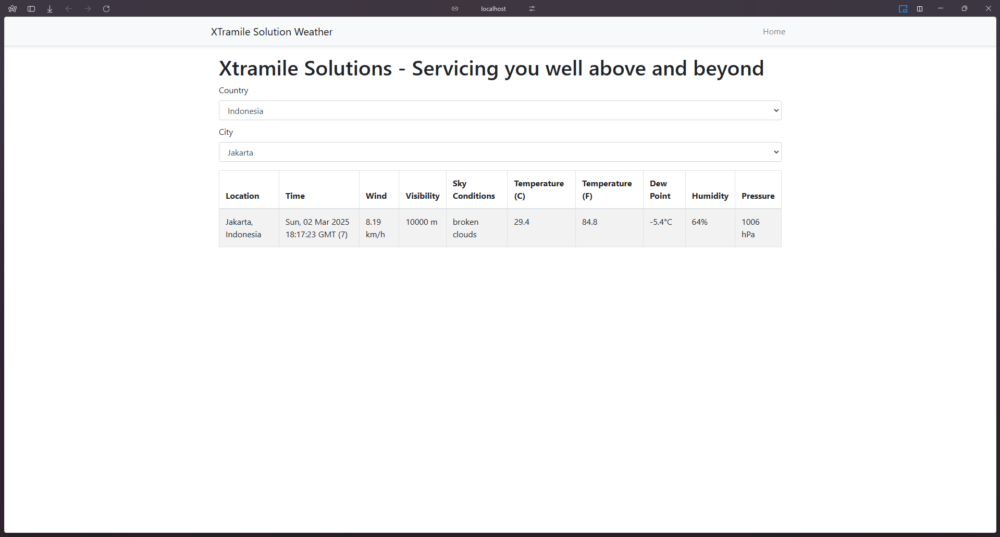

# Xtramile Solutions - Servicing you well above and beyond

## Task #2: Design and Coding Documentation

### **Introduction**
This project is a **.NET Core 3.1 MVC/Web API** application that fetches country and city data and retrieves weather information for a selected city. The system includes various enhancements to improve **maintainability, monitoring, debugging, and performance**.

### **Features Implemented**
- **Country & City Selection**:
  - Fetches a list of countries from a mock API.
  - Fetches cities based on the selected country.
- **Weather Data Retrieval**:
  - Retrieves weather data from OpenWeather API.
  - Converts temperature from Fahrenheit to Celsius.
- **Performance Enhancements**:
  - Uses in-memory storage for fast static data retrieval (country, city).
- **Security & Validation**:
  - **Sanitizer**: Cleans input data to prevent security risks.
  - **Fluent Validation**: Ensures correct input data formats.
- **Error Handling & Logging**:
  - **Problem Details**: Standardized error responses.
  - **Trace ID**: Issue tracking for debugging.
  - **Serilog**: Structured logging for debugging.
- **API Documentation & Testing**:
  - **Swagger Gen**: API documentation generation.
  - **Unit Testing**: Covers both service and controller layers.
  - **SonarQube CI**: Ensures maintainability and detects code smells.
- **Frontend Implementation**:
  - **React.js**: Interactive frontend.
  - **Bootstrap**: Responsive UI design.
  - **PathBase Support**: Allows flexible API base path configuration.

---

## **How to Start the Project**

### **1. Backend Setup**
#### **Environment Configuration**
Update `appsettings.json` with your **OpenWeather API key**:

```json
"WeatherApi": {
  "ApiKey": "your-open-weather-api",
  "BaseUrl": "https://api.openweathermap.org/data/2.5/weather"
}
```

#### **Run the API**
```sh
dotnet restore
dotnet build
dotnet run
```

### **2. Frontend Setup**
#### **Environment Configuration**
Create a `.env` file in the frontend root directory with the following content:

```sh
REACT_APP_BASE_API="https://localhost:5001/api"
```

#### **Run the Frontend**
```sh
npm install
npm start
```

---

## **API Endpoints**

### **1. Country & City API**
#### **Get All Countries**
- **Endpoint:** `GET /api/country`
- **Response:**
```json
["USA", "UK", "Japan"]
```

#### **Get Cities by Country**
- **Endpoint:** `GET /api/city/{countryId}`
- **Response:**
```json
["New York", "London", "Tokyo"]
```

### **2. Weather API**
#### **Get Weather by City**
- **Endpoint:** `GET /api/weather/{cityId}`
- **Response:**
```json
{
  "location": { "city": "Tokyo", "country": "Japan" },
  "time": { "localTime": "2023-03-02T12:00:00Z", "offset": 9 },
  "wind": { "speed": 10.5, "degree": 180, "gust": 15.2 },
  "visibility": 10000,
  "skyConditions": [{ "main": "Clear", "description": "Clear sky", "icon": "01d" }],
  "temperature": { "fahrenheit": 75.2, "celsius": 24, "dewPoint": 18.5 },
  "humidity": 65,
  "pressure": 1013
}
```

---

## **Unit Testing**
Run the test cases using:
```sh
dotnet test
```
### **Test Coverage**
- **Service Level Tests**:
  - Mocks OpenWeather API response.
  - Validates temperature conversion logic.
  - Tests exception handling scenarios.
- **Controller Level Tests**:
  - Mocks service response.
  - Tests behavior on success and failure cases.

---

## **CI/CD & Code Quality**
- **SonarQube**:
  - Run code analysis: using github action
- **Swagger Documentation**:
  - Available at `https://localhost:5001/swagger`
- **Logging & Debugging**:
  - All logs are stored via Serilog for better debugging.

---

## **Demo**


## **Conclusion**
This project demonstrates an efficient, well-structured **.NET Core 3.1 MVC/Web API** implementation with **React.js frontend**. It includes **validation, security, monitoring, and performance optimizations** while ensuring maintainability and testability.

> **Next Steps**: Deploy API and React app to a cloud provider and optimize response times.

---

✅ **Project Completed & Ready for Evaluation!** 🚀

